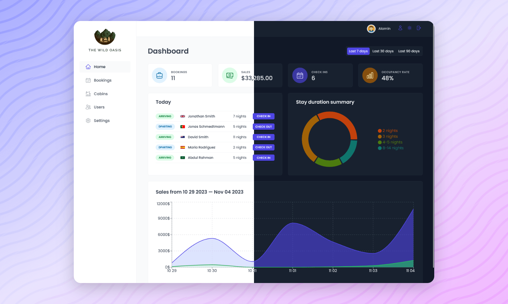

<div align="center">


# The Wild Oasis - Admin Dashboard

### [**Live Demo**](https://the-wild-oasis-salem.vercel.app)

[Report Bug](https://github.com/AbdelrahmanSalemQotb/The-Wild-Oasis/issues) • [Request Feature](https://github.com/AbdelrahmanSalemQotb/The-Wild-Oasis/pulls)

   <hr>
   
[](https://www.linkedin.com/in/abdelrahman-salem-qotb)


</div>

## Description

Welcome to **The Wild Oasis - Admin Dashboard**, your all-in-one solution for hotel management!

This powerful dashboard serves as the control center for hotel staff, providing everything needed to:

- Manage cabin listings and their availability
- Process guest check-ins and check-outs
- Track bookings and reservations in real-time
- Monitor hotel performance through intuitive analytics

Built with modern React and designed for efficiency, the dashboard makes complex hotel management tasks simple and intuitive. Whether you're updating cabin prices, confirming bookings, or reviewing monthly statistics, everything is just a few clicks away.

[](https://the-wild-oasis-salem.vercel.app)

## Customer Version

A customer version of this application is available for explore cabins, book, and manage stays:

- [GitHub Repository](https://github.com/AbdelrahmanSalemQotb/the-wild-oasis-booking)
- [Live Site](https://the-wild-oasis-booking-salem.vercel.app/)

## Features

- 📊 **Dashboard**: Real-time statistics and booking analytics with interactive charts for **_sales trends_**, **_occupancy rates_**, and **_revenue insights_**.
- 🏠 **Cabin Management**: Allows adding, editing, or deleting cabin details, with real-time availability updates.
- 📅 **Booking Operations**: Enables viewing, creating, and managing bookings with real-time updates, including check-ins, check-outs, and status changes.
- 👥 **Guest Management**: Offers access to detailed guest profiles, including booking history and contact information.
- ⚙️ **Settings Management**: Configure application-wide settings, including pricing, capacity, and booking rules.
- 🔐 **User Authentication**: Secure staff member accounts.
- 🌓 **Dark Mode**: Provides a toggle between light and dark themes for better user experience.
- 📱 **Responsive Design**: Optimized for all device sizes.

## Technologies Used

- [**React**](https://react.dev/) main library
- [**React Router**](https://reactrouter.com/) for client-side routing
- [**Styled Components**](https://styled-components.com/) for styling
- [**React Query**](https://tanstack.com/query/latest/) for efficient state and data fetching with caching
- [**React Hook Form**](https://react-hook-form.com/) for efficient form handling
- [**Supabase**](https://supabase.com/) for database and authentication
- [**Recharts**](https://recharts.org/) for data visualization
- [**React Hot Toast**](https://react-hot-toast.com/) for notifications
- [**React Icons**](https://react-icons.github.io/react-icons/) for UI icons

## Getting Started

1. **Clone the repository:**

   ```bash
   git clone https://github.com/AbdelrahmanSalemQotb/The-Wild-Oasis.git
   cd The-Wild-Oasis
   ```

2. **Install dependencies:**

   ```bash
   npm install
   ```

3. **Configure environment variables:** Create a `.env` file with your Supabase credentials:

   ```
   VITE_SUPABASE_URL=your_supabase_url
   VITE_SUPABASE_KEY=your_supabase_anon_key
   ```

   > **Note:** You can get these credentials from your Supabase project:
   >
   > - Create an account on [Supabase](https://supabase.com/)
   > - Create a new project
   > - Go to Project Settings -> API
   > - Copy your Project URL and `anon` `public` key

4. **Start the development server:**
   ```bash
   npm run dev
   ```

## Database Setup

Create the following tables in your Supabase project (You can use the SQL editor in Supabase or a database client):

- bookings table
- cabins table
- guests table
- settings table

The full SQL to create the tables can be found in the [Supabase Tables](#supabase-tables) section below.

> **Important Note:** The admin version and customer version share the same database tables. If you've already created the tables for the customer version, you do not need to create them again for the admin version.

## Supabase Tables

Here are the SQL table definitions used for managing bookings, cabins, guests, and settings:

### Cabins Table

```sql
create table public.cabins (
  id bigint generated by default as identity not null,
  created_at timestamp with time zone not null default now(),
  name text null,
  "maxCapacity" smallint not null,
  "regularPrice" smallint not null,
  discount smallint not null default '0'::smallint,
  description text null,
  image text null,
  constraint cabins_pkey primary key (id),
  constraint cabins_id_key unique (id)
);
```

### Guests Table

```sql
create table public.guests (
  id bigint generated by default as identity not null,
  created_at timestamp with time zone not null default now(),
  "fullName" text not null,
  email text not null,
  "nationalID" text null,
  nationality text null,
  "countryFlag" text null,
  constraint guests_pkey primary key (id),
  constraint guests_id_key unique (id),
  constraint unique_email unique (email)
);
```

### Bookings Table

```sql
create table public.bookings (
  id bigint generated by default as identity not null,
  created_at timestamp with time zone not null default now(),
  "startDate" timestamp without time zone not null,
  "endDate" timestamp without time zone not null,
  "numNights" smallint not null,
  "numGuests" smallint not null,
  "cabinPrice" real not null,
  "extrasPrice" real not null default '0'::real,
  "totalPrice" real not null,
  status text not null,
  "hasBreakfast" boolean not null default false,
  "isPaid" boolean not null default false,
  observations text null,
  "guestId" bigint not null,
  "cabinId" bigint not null,
  constraint boookings_pkey primary key (id),
  constraint bookings_id_key unique (id),
  constraint bookings_cabinId_fkey foreign key ("cabinId") references cabins (id),
  constraint bookings_guestId_fkey1 foreign key ("guestId") references guests (id)
);
```

### Settings Table

```sql
create table public.settings (
  id bigint generated by default as identity not null,
  created_at timestamp with time zone not null default now(),
  "minBookingLength" smallint not null,
  "maxBookingLength" smallint not null,
  "maxGuestsPerBooking" smallint not null,
  "breakfastPrice" real not null,
  constraint Settings_pkey primary key (id),
  constraint settings_id_key unique (id)
);
```

> **Important Note:** The admin version and customer version share the same database tables. If you've already created the tables in the customer version, you do not need to create them again for the admin version.

## Author

### Abdelrahman Salem

<div align="center">

[](https://github.com/AbdelrahmanSalemQotb) [](https://www.linkedin.com/in/abdelrahman-salem-qotb)

</div>

## Acknowledgments

Special thanks to [Jonas Schmedtmann](https://jonas.io/) for the excellent React [course](https://www.udemy.com/course/the-ultimate-react-course) that served as the foundation for this project.
